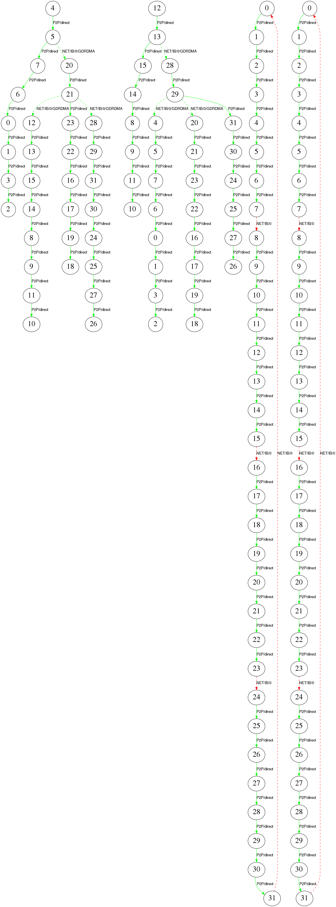

# Topology Visualizer
Topology Visualizer extracts topology information from RCCL log file and presents graphically. Less than optimal connections between GPUs and nodes are highlighted in red for easy identification.

## Requirements
Following packages are required to run Topology Visualizer:
1. gawk
2. graphviz

## Usage
Topology Visualizer accepts both RCCL log files or simulator output, i.e. [Topology Explorer](https://github.com/ROCm/rccl/tree/master/tools/topo_expl "Topology Explorer").

RCCL logs needs to be collected with NCCL_DEBUG=INFO and NCCL_DEBUG_SUBSYS=INIT,GRAPH environmental variables. Example command line:
```shell
mpirun -np 4 -host rocm-framework-1,rocm-framework-3,rocm-framework-5,rocm-framework-6 \
  -env HSA_FORCE_FINE_GRAIN_PCIE 1 -env NCCL_DEBUG INFO -env NCCL_DEBUG_SUBSYS INIT,GRAPH \
  ~/rccl-tests/build/all_reduce_perf -b 8 -e 128M -f 2 -g 8 | tee ~/4_nodes.log

./topo_visual.sh -i 4_nodes.log
```

## Legend

Solid lines: connections over P2P or shared memory

Dashed lines: connections over network

Green: P2P connections, network connections with GPU RDMA

Red: Connections over shared memory or without GPU RDMA

## Example Output


## Copyright
All source code and accompanying documentation are copyright (c) 2019-2020 Advanced Micro Devices, Inc. All rights reserved.
